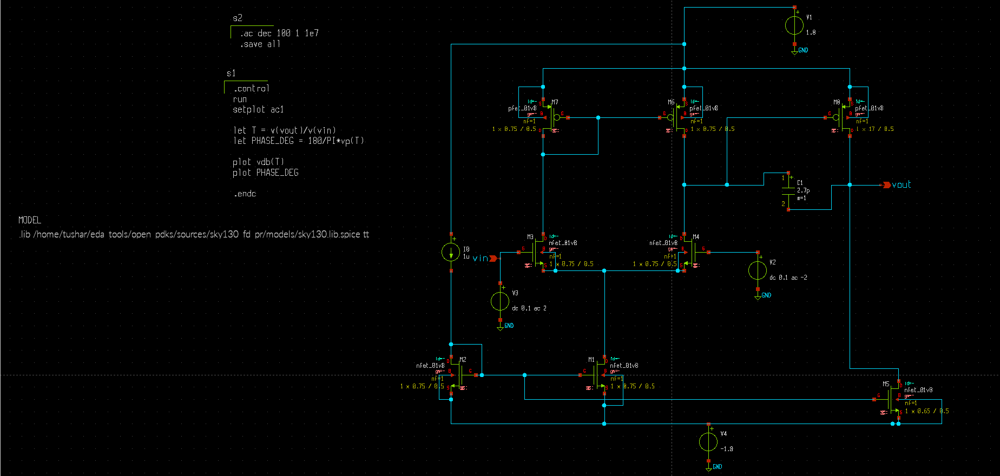
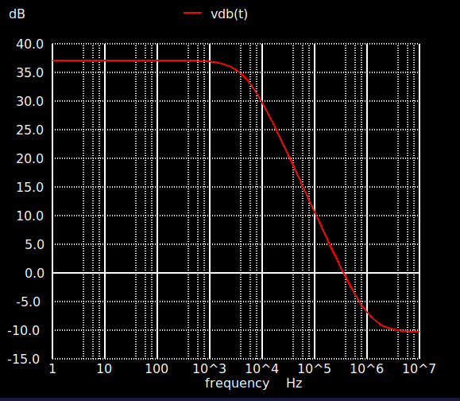
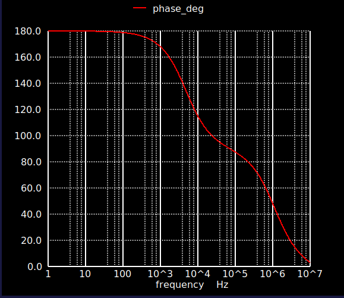

# Two-Stage CMOS Operational Amplifier  
### SKY130A | Xschem | NGSpice

---

## 📌 Project Summary
This project demonstrates the **design and analysis of a two-stage CMOS operational amplifier** using the **SkyWater 130nm (SKY130A) PDK**.  
The transistor-level schematic is implemented in **Xschem**, and simulations are conducted using **NGSpice**.

The main goal is to study the amplifier's **frequency response, voltage gain, stability, phase margin, and gain margin** while applying Miller compensation for improved stability.

---

## 🛠️ Tools & Platform
- **Xschem** – For schematic capture  
- **NGSpice** – For circuit simulation  
- **SkyWater SKY130A PDK** – Process design kit for 130nm CMOS  
- **Linux environment** – Development and simulation

---

## 🧩 Circuit Architecture
The design comprises two amplification stages and compensation circuitry to ensure stability.

### 🔹 First Stage
- NMOS differential pair as the input stage  
- PMOS current mirror as load  
- Provides high differential gain at low frequencies  

### 🔹 Second Stage
- Common-source amplifier stage  
- Boosts overall voltage gain to target specifications  

### 🔹 Miller Compensation
- Capacitor connected between the first-stage output and second-stage input  
- Stabilizes the amplifier and ensures adequate phase margin  

### 🔹 Biasing Network
- Constant current sources provide proper biasing for both stages, ensuring all transistors operate in saturation  



---

## ⚙️ Simulation Procedures
The amplifier was tested in NGSpice using the following analyses:

- **DC Operating Point Analysis**  
- **AC Frequency Response Analysis** (Gain and Phase)  
- **Stability Analysis** (Phase Margin and Gain Margin)

### AC Simulation Command
```spice
.ac dec 100 1 1e7
```

---

## 📈 Simulation Observations

### 🔹 DC Gain
- Low-frequency voltage gain ≈ 38 dB

### 🔹 Unity Gain Bandwidth (UGB)
- UGB ≈ 1 MHz

### 🔹 Phase Margin
- Phase at unity gain ≈ 60°  
- Phase Margin ≈ 60°

### 🔹 Gain Margin
- Gain at −180° phase ≈ −10 dB  
- Gain Margin ≈ 10 dB

---

## ✅ Performance Summary

| Parameter            | Observation |
|--------------------- |------------|
| DC Gain              | ~38 dB     |
| Unity Gain Bandwidth | ~1 MHz     |
| Phase Margin         | ~60°       |
| Gain Margin          | ~10 dB     |
| Stability            | Stable     |

The amplifier demonstrates **reliable stability** due to Miller compensation.

---

## 📸 Simulation Plots

- **Bode Magnitude Plot (Gain vs Frequency)**  


- **Bode Phase Plot (Phase vs Frequency)**  


---
