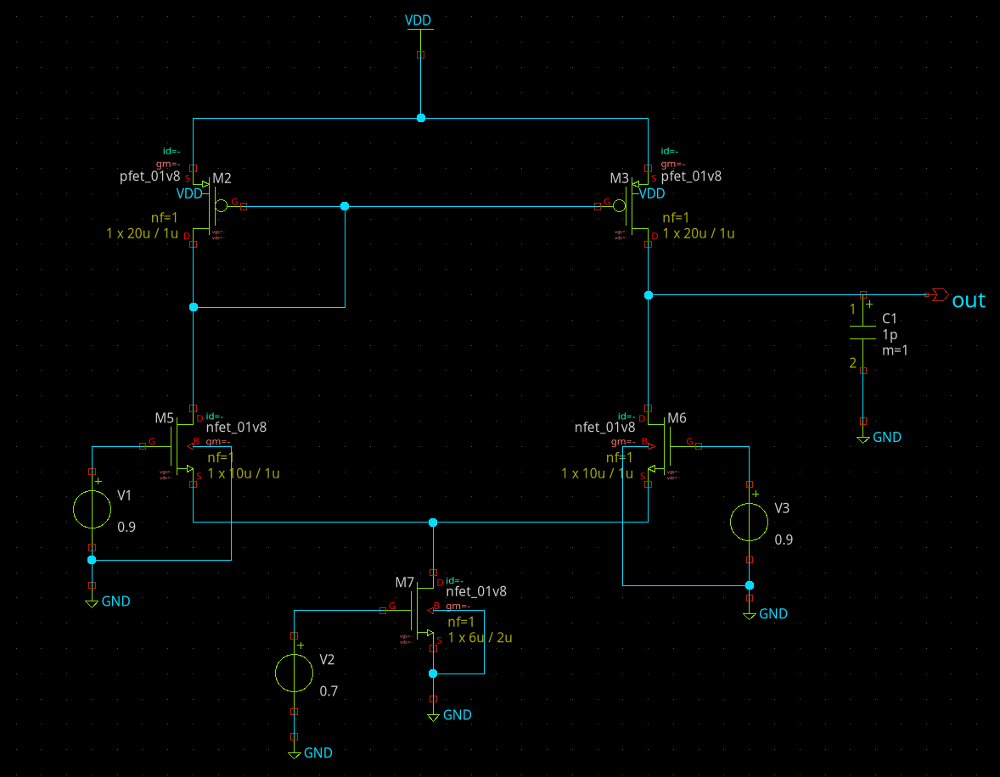
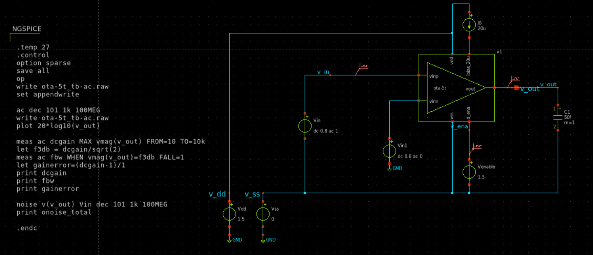
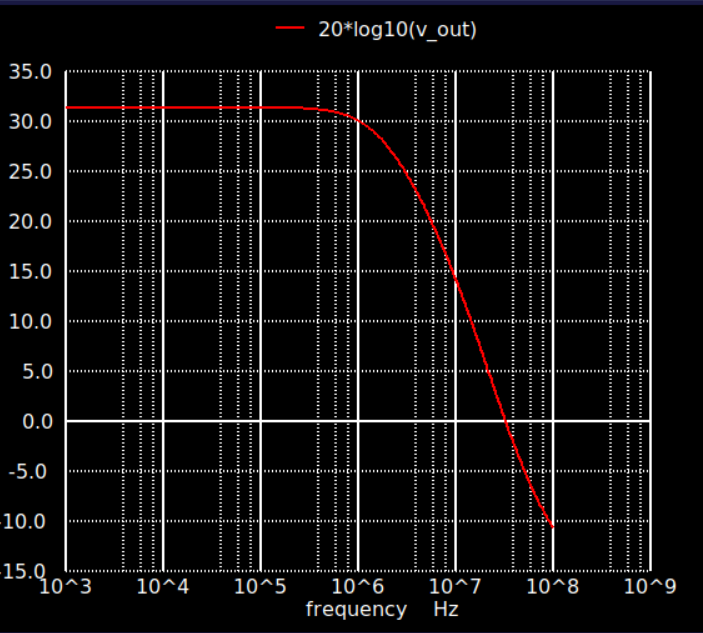

# 5-Transistor Operational Transconductance Amplifier (OTA)

**CMOS Technology:** SKY130 (sg13_lv)  
**Design Tools:** Xschem, Ngspice  
**Supply Voltage:** 1.5 V  

---

## 📘 Introduction
This project demonstrates the design and simulation of a **5-transistor Operational Transconductance Amplifier (5T OTA)** using the **SKY130 CMOS process**. The goal is to implement a **low-power, compact analog amplifier** with minimal transistor count, making it suitable for introductory analog VLSI studies and basic analog building blocks.

The work includes:
- Transistor-level schematic design  
- Biasing and enable control  
- DC operating point verification  
- Small-signal AC frequency analysis  

---

## 🏗️ OTA Architecture
The implemented OTA follows a classical **single-stage 5T topology**, consisting of:
- NMOS differential input pair  
- PMOS current mirror as active load  
- NMOS tail current source  
- Enable-controlled bias network  

### Key Features
- Low power consumption  
- Compact circuit design  
- Simple biasing scheme  
- Moderate gain and limited output swing (typical of 5T OTAs)

---

## 🧠 Schematic Design

### OTA Core Schematic
The schematic below shows the complete transistor-level implementation of the OTA, including the differential pair, current mirror load, and bias circuitry.

---

### AC Testbench
An AC testbench is created in Xschem to analyze the frequency response of the OTA.

**Simulation configuration:**
- Differential AC excitation  
- Output load capacitance: **50 fF**  
- Frequency sweep range: **1 kHz – 100 MHz**

---

## 📊 AC Frequency Response

### Performance Summary
- **DC Gain:** ~30–32 dB  
- **Dominant Pole Frequency:** ~1 MHz  
- **Gain Roll-off:** −20 dB/decade  
- **Unity Gain Bandwidth:** ~10–20 MHz  

The response exhibits dominant single-pole behavior, ensuring stable operation without additional compensation.

---

## ⚙️ DC Operating Point Analysis
The DC operating point analysis confirms that:
- All MOS transistors operate in saturation  
- Bias voltages are within acceptable limits  
- The circuit functions correctly at a 1.5 V supply  

---

## 📐 Design Parameters

| Parameter | Value |
|---------|-------|
| Technology | SKY130 |
| Supply Voltage | 1.5 V |
| Tail Current | ~4 µA |
| Load Capacitance | 50 fF |
| OTA Type | Single-stage 5T OTA |

---

## 🧪 Simulation Details
- **Simulator:** Ngspice  
- **Analyses Performed:**  
  - `.op` for DC operating point  
  - `.ac` for small-signal frequency response  

Key parameters such as gain and bandwidth are extracted using Ngspice control commands.

---

## 📚 Learnings and Observations
- Trade-offs involved in low-transistor-count OTA designs  
- Biasing challenges at low supply voltages  
- Dominant pole behavior in single-stage amplifiers  
- Practical exposure to analog simulation using Xschem and Ngspice  

---

## 📎 Conclusion
This project provides hands-on experience in designing a minimal CMOS OTA and analyzing its performance. Despite its simplicity, the 5T OTA effectively demonstrates key analog design concepts such as gain-bandwidth trade-offs and biasing constraints in low-voltage environments.
