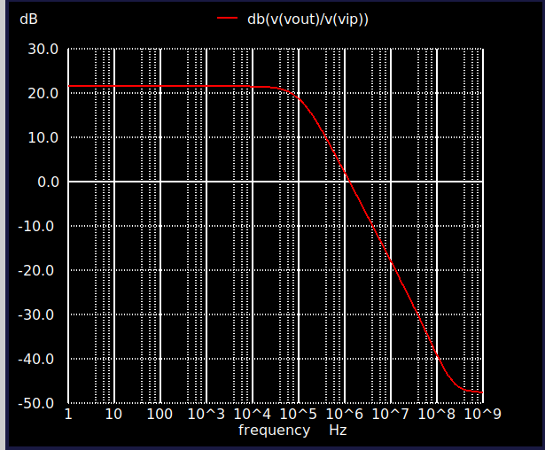
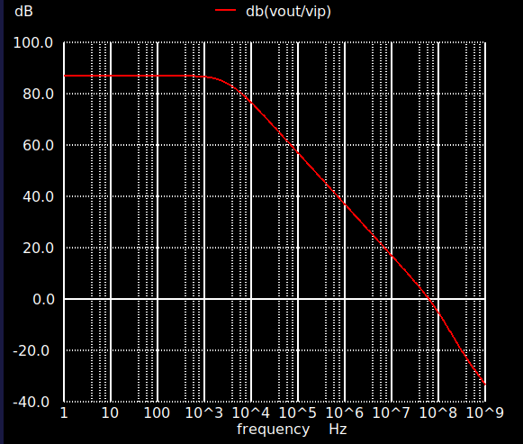

# Telescopic CMOS Operational Amplifier  
### SKY130A | Xschem | NGSpice

---

## 📌 Project Summary
This project demonstrates the **design and AC characterization of a Telescopic CMOS Operational Amplifier** using the **SkyWater 130 nm (SKY130A) PDK**.  
The schematic is implemented in **Xschem**, and all simulations are conducted using **NGSpice**.

The main goal is to study **high-gain operation, frequency response**, and how **bias voltages, tail current, and transistor sizing (W/L)** affect the amplifier's performance.

---

## 🛠️ Tools & Platform
- **Xschem** – For schematic entry  
- **NGSpice** – For circuit simulation  
- **SkyWater SKY130A PDK** – CMOS process models  
- **Linux OS** – Simulation and design environment

---

## 🧩 Circuit Overview
The telescopic op-amp is a **single-stage high-gain amplifier** that leverages cascoding to increase output resistance and voltage gain.

### 🔹 Key Circuit Components
- NMOS differential input stage  
- NMOS and PMOS cascode devices  
- Tail current source for biasing  
- Single-ended output node  

### 🔹 Features
- High intrinsic voltage gain  
- Low power consumption  
- Reduced output swing compared to multi-stage op-amps  
- Suitable for high-speed applications

---

## ⚙️ Simulation Setup

### AC Small-Signal Analysis
AC simulations are used to observe **gain as a function of frequency**:

```spice
.ac dec 100 1 1e9
```

### Schematic Representation
The transistor-level design in Xschem:


---

## 📈 Simulation Results

### 🔹 Initial Frequency Response
Initial simulations show:
- Moderate DC gain  
- Early roll-off due to biasing and device sizing  
- Limited bandwidth with initial transistor dimensions  



---

### 🔹 Optimized Frequency Response
After tuning bias voltages, tail current, and W/L ratios:
- DC gain increased  
- Frequency response widened  
- Overall AC performance improved  



---

## ✅ Performance Summary

| Parameter | Observation                                   |
|----------|-----------------------------------------------|
| DC Gain  | Increased after bias and sizing adjustments  |
| Bandwidth| Improved through optimization                |
| Power    | Low (single-stage design)                     |
| Stability| Stable due to dominant single pole           |

---

## 🧠 Design Notes
- Cascoding improves output resistance, increasing gain  
- Proper biasing ensures all devices remain in saturation  
- Telescopic op-amps trade output swing for speed and gain  
- Single-stage design avoids Miller compensation requirements

---

## 📚 Key Learnings
- Understanding the architecture of telescopic op-amps  
- Practical experience with the SKY130A PDK  
- Insights on biasing and transistor sizing trade-offs  
- AC performance analysis using NGSpice